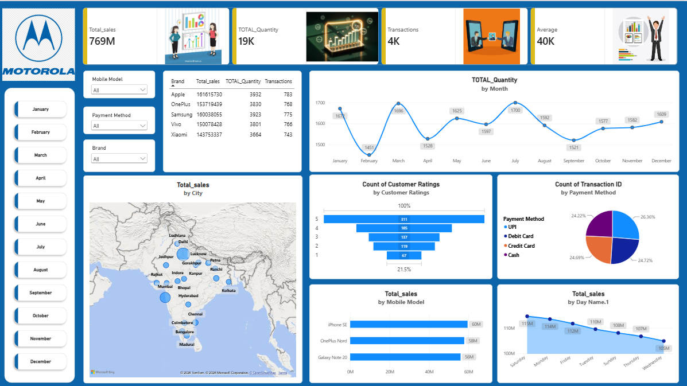

# 📱 Mobile Sales & Transaction Analysis Dashboard

## 📊 Project Overview

This project is an interactive **Mobile Sales & Transaction Analysis Dashboard** developed using **Microsoft Power BI**.

The dashboard transforms mobile sales data into meaningful and interactive visual insights covering sales performance, quantity, transactions, customer ratings, payment methods, brands, mobile models, cities, and time-based trends.

This project was completed as part of my practical Power BI learning journey with **SkillCourse under the guidance of Satish Dhawale, Founder of SkillCourse**.

---

## 🎯 Objectives

- Analyze overall mobile sales performance
- Track total sales, quantity, transactions, and average sales
- Compare sales performance across mobile brands and models
- Analyze city-wise sales performance
- Understand customer rating distribution
- Analyze different payment methods
- Identify monthly and day-wise sales trends
- Build an interactive and user-friendly Power BI dashboard
- Practice presenting business data through effective visualizations

---

## 📌 Key KPIs

| KPI | Value |
|---|---:|
| **Total Sales** | 769M |
| **Total Quantity** | 19K |
| **Total Transactions** | 4K |
| **Average Sales** | 40K |

---

## 📈 Dashboard Visualizations

### 1. 📊 Total Quantity by Month
Shows the monthly trend of mobile quantities sold and helps identify changes in sales volume throughout the year.

### 2. 🗺️ Total Sales by City
Provides a geographic view of sales performance across different cities.

### 3. ⭐ Customer Ratings Analysis
Displays the distribution of customer ratings from 1 to 5.

### 4. 💳 Transactions by Payment Method
Analyzes transactions made through:
- UPI
- Debit Card
- Credit Card
- Cash

### 5. 📱 Total Sales by Mobile Model
Compares sales performance across different mobile models.

### 6. 📅 Total Sales by Day Name
Shows sales trends across different days of the week.

### 7. 🏷️ Brand-wise Analysis
Provides a comparison of sales, quantity, and transactions across different mobile brands.

### 8. 🎛️ Interactive Slicers
The dashboard includes interactive filters for:
- Mobile Model
- Payment Method
- Brand
- Month

These slicers allow users to dynamically explore different aspects of the dataset.

---

## 🖼️ Dashboard Preview

Here is a preview of the interactive Mobile Sales & Transaction Analysis Dashboard developed using Microsoft Power BI.

---

## 🛠️ Tools & Technologies

- **Microsoft Power BI**
- **Power Query**
- **Data Visualization**
- **Data Analysis**
- **Interactive Slicers**
- **KPI Cards**
- **Charts & Graphs**
- **Map Visualization**

---

## 📚 Skills Practiced

- Data cleaning and transformation
- Data visualization
- KPI creation
- Interactive filtering
- Trend analysis
- Geographic analysis
- Business-oriented dashboard design
- Data storytelling
- Dashboard layout and presentation
- Business data interpretation

---

## 🎓 Learning Source

This project was created as part of my Power BI learning journey with:

**SkillCourse**

**Mentor:** Satish Dhawale – Founder, SkillCourse

The practical learning approach helped me understand how to transform raw data into an interactive dashboard and present business information through meaningful visualizations.

---

## 🚀 Future Improvements

- Add more advanced DAX measures
- Add additional business KPIs
- Improve drill-through analysis
- Add more detailed product and customer analysis
- Add additional interactive features
- Improve dashboard storytelling
- Publish and share the interactive Power BI report where appropriate

---

## 👨‍💻 Author

**Tilak S Badami**

Electronics & Communication Engineering | Aspiring Data Analyst

**Skills:**  
Excel | Power BI | SQL | Python | Data Analytics

---

⭐ If you find this project useful, feel free to explore the repository and connect with me on LinkedIn.
